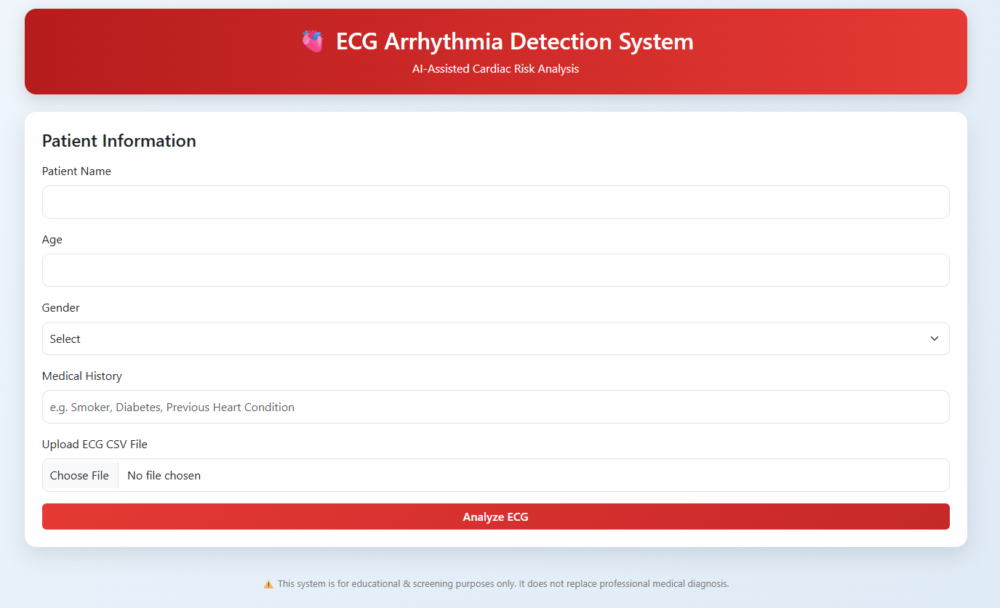
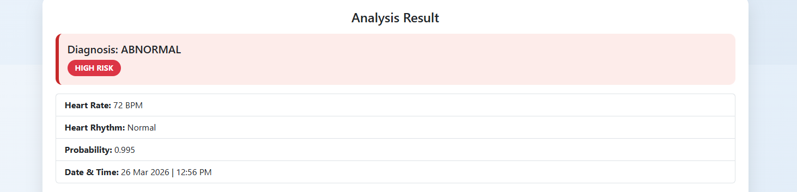
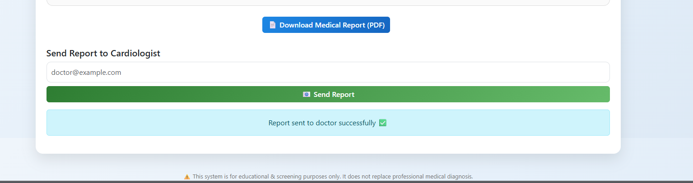

🫀 ECG Arrhythmia Detection System

AI-Assisted Cardiac Risk Analysis Web Application

📌 Overview

The ECG Arrhythmia Detection System is a web-based application that analyzes ECG (Electrocardiogram) signals using Deep Learning (CNN + LSTM) to detect abnormal heart rhythms.

It helps in:

1) Identifying Normal vs Abnormal ECG
2) Calculating Heart Rate (BPM)
3) Determining Risk Level
4) Generating a Medical PDF Report
5) Sending the report to a Cardiologist via Email

🎯 Problem Statement
- ECG interpretation requires expertise
- Manual analysis is time-consuming
- Early detection of heart issues is critical

👉 This system uses AI to assist in quick preliminary diagnosis

🧠 How It Works (Simple Explanation)
1) User uploads ECG CSV file
2) Signal is filtered & cleaned
3) Peaks (heartbeats) are detected
4) Model predicts each heartbeat
5) Average probability is calculated

System outputs:
1) Diagnosis
2) Risk level
3) BPM (Heart Rate)

🛠️ Tech Stack

🔹 Backend
- Python
- Flask

🔹 Machine Learning
- TensorFlow / Keras
- CNN + LSTM Model
- SciPy (Signal Processing)

🔹 Frontend
- HTML
- CSS
- Bootstrap

🔹 Additional Tools
- Matplotlib → ECG Graph
- ReportLab → PDF Generation
- SMTP → Email Sending

## 📸 Screenshots

### 🏠 Home Page

### 📊 Analysis Result

### 📈 ECG Graph

### 📧 Email Sent

